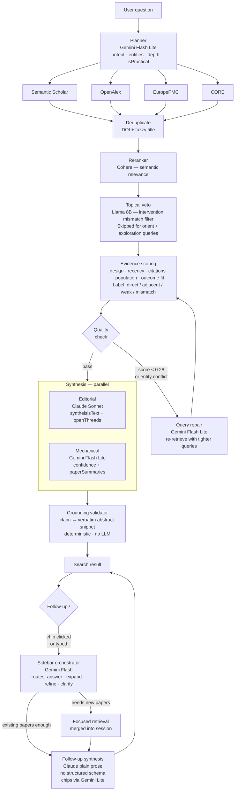

# Clarity

A scientific investigation tool. You type a messy human question. Clarity searches the research literature, reads the papers, and gives you an honest grounded answer — with every claim traceable to a real abstract passage.

**Core principle: the papers are the authority, not the AI.** The AI orients you. It does not deliver verdicts.

---

## What It Does

Two surfaces:

- **Search** — ask a research question, get multi-paper evidence synthesis. Claims link back to verbatim abstract text. This is the main product.
- **Document Analysis** — upload a single paper, get an editorial review with trust calibration and grounding. (Secondary surface.)

---

## How a Search Works

```
You type: "does creatine actually help the brain?"
```

### Step 1 — The planner reads your question

A fast model (Gemini Flash Lite) extracts:
- **Intent** — is this a claim-check, a comparison, a dose question, a broad exploration?
- **Entities** — the specific things you're asking about (creatine, brain, cognitive performance)
- **Hidden goals** — what you probably care about underneath (memory? sleep deprivation? aging?)
- **Conversation depth** — orient (broad first look), answer (specific question), review (comprehensive)
- **Practical mode** — are you asking what to *do*, not just what the evidence *says*?

### Step 2 — Retrieval from four sources in parallel

Semantic Scholar, OpenAlex, EuropePMC, and CORE are all queried simultaneously. Direct evidence queries run first. If fewer than 12 papers come back, broader context queries run too. All four sources degrade gracefully — if Semantic Scholar is rate-limited, the other three continue.

### Step 3 — Filter and rank

Papers go through four layers:
1. **Deduplication** — same paper from different sources merged by DOI and fuzzy title match
2. **Reranker** (Cohere) — semantic relevance score per paper; obvious noise dropped
3. **Topical veto** (Llama 8B) — conservative LLM filter for clear intervention/condition mismatches; orient-mode queries bypass this
4. **Evidence scoring** — each paper scored on study design (meta > RCT > cohort > editorial), recency, citation percentile, population type, and how directly it answers your question (direct / adjacent / weak / mismatch)

Top 10 papers advance to synthesis.

### Step 4 — Quality check + optional repair

A judge model scores retrieval quality. If the score is below threshold, or if entity conflation is detected (e.g., got papers about creatine for muscular dystrophy instead of cognition), a repair cycle re-retrieves with tightened queries. Maximum one repair.

### Step 5 — Synthesis (two parallel calls)

**Editorial model** (Claude Sonnet in production):
- Reads all 10 papers
- Writes the answer in the voice of a smart, honest friend who reads research
- Identifies 2–4 `openThreads` — things it deliberately left unsaid, which become the follow-up chips
- Calibrated by conversation depth: orient queries get a 180–280 word focused answer; review queries get comprehensive coverage

**Mechanical model** (Gemini Flash Lite in parallel):
- Extracts confidence level: preliminary / promising / moderate / strong
- Writes one plain-English sentence per paper (shown in sidebar)
- Flags if there's genuinely no relevant evidence

Both run at the same time. Total latency ≈ 20s.

### Step 6 — Grounding

Every claim in the synthesis is matched back to a verbatim abstract passage — deterministic bigram matching, no LLM. Claims that can't be grounded are flagged. Causal overreach and invented numbers are caught before the response is sent.

### Step 7 — UI

```
┌────────────────────────────────┬─────────────────────────────┐
│  Chat (left)                   │  Papers sidebar (right)     │
│                                │                             │
│  Answer prose                  │  "Claims & evidence"        │
│  Confidence badge              │    ↳ claim rows + snippets  │
│  Follow-up chips               │                             │
│  [click chip → new turn]       │  "Start here"               │
│                                │    ↳ 2 recommended papers   │
│  Filter bar:                   │                             │
│  All / RCTs+Meta / Human only  │  Turn groups                │
│                                │    ↳ Original evidence      │
│                                │    ↳ Added: "asked about X" │
│                                │                             │
│                                │  Click paper → full detail  │
│                                │  (abstract, badges, deep    │
│                                │   read, contradiction flag) │
└────────────────────────────────┴─────────────────────────────┘
```

---

## The Search Pipeline (diagram)



---

## What Determines the Answer Shape

| Signal | Detected by | Effect |
|--------|-------------|--------|
| `conversationDepth: orient` | "tell me about X", "what is Y" | 180–280 word answer, broad openThreads |
| `conversationDepth: answer` | specific question (default) | precise answer, adjacent angles in openThreads |
| `conversationDepth: review` | "full review", "exhaustive overview" | comprehensive coverage |
| `isPracticalQuery: true` | "should I", "is it worth", "what should I do" | leads with recommendation, then evidence |
| `isComparison: true` | "X vs Y", "as good as" | leads with best proxy finding, names gap explicitly |
| `intentType: claim_check` | "I heard that…", "is it true that…" | steelmans the claim first, then full picture |
| Low retrieval quality | judge score < 0.28 | triggers query repair cycle |
| `noEvidence: true` | mechanical model | synthesis says so directly |

---

## Follow-up Turns

After the initial answer, the user can:

- **Click a follow-up chip** — generated by Claude from `openThreads` (what it deliberately left unsaid)
- **Type a free question** — classified by the sidebar orchestrator

The orchestrator picks one of five actions:
1. `answer_current_results` — answer from existing papers (no new retrieval)
2. `refine_current_canvas` — filter existing papers, re-synthesise
3. `focused_retrieval_expansion` — fetch new papers, merge into session, re-synthesise
4. `clarification_prompt` — rarely used; only for genuinely unparseable queries
5. `exhaustive_intent_transparency` — explains scope limits

Session evidence accumulates across turns. The sidebar shows paper groups per turn with NEW badges.

---

## Monorepo Layout

```
artifacts/clarity/          Vite React frontend
artifacts/api-server/       Express API server
  src/lib/search/           The full search pipeline
    researchPlanner.ts      Step 1 — intent + entity extraction
    retrieval.ts            Step 2 — four-source parallel fetch
    dedupe.ts               Step 3a — DOI + title dedup
    reranker.ts             Step 3b — Cohere rerank
    topicalVeto.ts          Step 3c — LLM mismatch filter
    ranking.ts              Step 3d — evidence scoring + sort
    evidenceFit.ts          Step 3e — direct/adjacent/weak/mismatch per paper
    retrievalJudge.ts       Step 4 — quality score + repair trigger
    queryRepair.ts          Step 4b — re-retrieval with tighter queries
    synthesizer.ts          Step 5 — editorial + mechanical synthesis
    groundingValidator.ts   Step 6 — causal overreach + number checks
    evidenceSpans.ts        Step 6b — claim → snippet matching
    index.ts                Pipeline orchestrator (runSearch)
    types.ts                All TypeScript types
  src/routes/search.ts      HTTP layer, follow-up dispatch, session writes
lib/db/                     Drizzle schema + database access
```

---

## For New Contributors / Agents

**Read in this order:**

1. `AGENTS.md` — what we build for, voice rules, non-negotiables
2. `ONBOARDING.md` — 5-minute pipeline walkthrough, current bugs, recent fixes
3. `ARCHITECTURE.md` — detailed system structure and model assignments
4. `PROMPTS.md` — synthesis prompt, editorial voice constraints
5. `artifacts/api-server/src/lib/search/synthesizer.ts` — the most important file

---

## Local Development

```bash
pnpm install
cp .env.example .env        # set OPENROUTER_API_KEY
docker compose up -d        # start Postgres
pnpm --filter @workspace/db push
pnpm dev                    # frontend on :5175, API on :8085
```

---

## Deployment

| Surface | Host |
|---------|------|
| Frontend | Vercel (root: `artifacts/clarity`) |
| API server | Railway (repo-root `Dockerfile`) |
| Database | Railway Postgres |

Railway auto-deploys on push to `main`. Vercel auto-deploys frontend.

Vercel proxies `/api/*` to Railway so auth cookies stay same-origin. Do not set `VITE_API_BASE_URL` in Vercel production env.

**Required Railway env vars:**

```
DATABASE_URL
PORT=8085
NODE_ENV=production
SESSION_SECRET=...
SESSION_COOKIE_NAME=clarity.sid
CORS_ORIGIN=https://your-vercel-app.vercel.app
OPENROUTER_API_KEY=...
OPENROUTER_SEARCH_MODEL=anthropic/claude-sonnet-4-6
```

After first deploy: `pnpm --filter @workspace/db push`

---

## Verification Before Shipping

```bash
pnpm typecheck
pnpm build
```

Then manually test: register → login → run a search → click a follow-up chip → check paper sidebar → expand a paper → check grounding.
